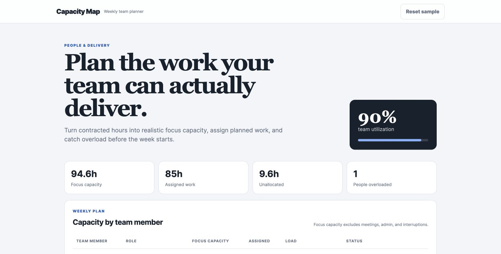

# Capacity Map — Team Capacity Planner

[](https://github.com/coo-tools/team-capacity-planner/actions/workflows/test.yml)
[](https://coo-tools.github.io/team-capacity-planner/)
[](LICENSE)

A practical weekly capacity planner that separates contracted time from realistic focus time. It helps small teams spot overload before work is committed.

**[Open the live application](https://coo-tools.github.io/team-capacity-planner/)**



## Operating principle

Calendar hours are not delivery capacity. The focus-time adjustment makes meetings, administration, and normal interruptions visible before work is committed.

## Features

- Converts weekly hours and focus percentage into usable capacity
- Tracks assigned work by team member
- Flags available, near-limit, and overloaded team members
- Summarizes total capacity, assigned work, and remaining hours
- Stores the plan locally in the browser
- Unit-tested calculation logic

## Decision logic

Focus capacity equals contracted hours multiplied by focus percentage. Assigned work below 85% of focus capacity is **Available**, 85–100% is **Near limit**, and anything above 100% is **Overloaded**.

## Run locally

```bash
python3 -m http.server 8000
```

Visit `http://localhost:8000`.

## Quality checks

```bash
npm test
```

The same checks run automatically on every pull request and every change to `main`. See [TESTING.md](TESTING.md) for manual acceptance scenarios.

## Project status

Version 1.0 is a stable, client-side baseline. Planned improvements are tracked in GitHub Issues. Contributions are welcome through [CONTRIBUTING.md](CONTRIBUTING.md).

## License

MIT
